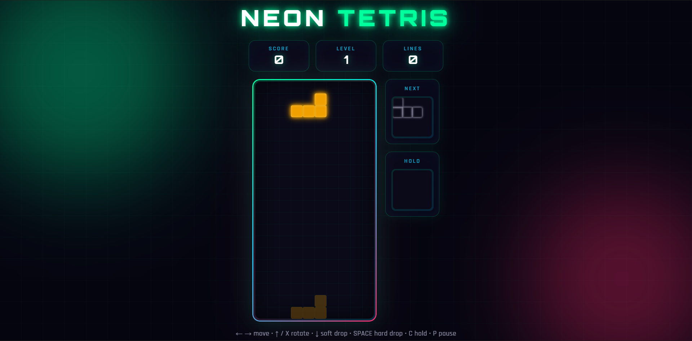

# Neon Tetris



## A modern, neon-styled Tetris game built with pure HTML, CSS, and vanilla JavaScript.

## [Play Online](https://souravbanerjeedata.github.io/tetris/)

---

## Features

- **Neon visual design** — glowing tetrominoes, animated background grid, floating orbs
- **Next piece preview** + **Hold** (press `C`)
- **Ghost piece** showing where the current piece will land
- **Scoring & levels** — lines clear faster as level increases
- **7-bag randomizer** for fair piece distribution
- **Hard drop** (Space) and soft drop (↓)
- **Wall kicks** for smoother rotation near edges
- **Pause** (P)
- **Mobile-friendly** — swipe left/right to move, tap to rotate, swipe down to soft/hard drop
- Fully responsive layout

---

## Controls

### Desktop

| Key    | Action                   |
| ------ | ------------------------ |
| ← →    | Move left / right        |
| ↑ or X | Rotate clockwise         |
| Z      | Rotate counter-clockwise |
| ↓      | Soft drop                |
| Space  | Hard drop                |
| C      | Hold / swap piece        |
| P      | Pause / resume           |

### Mobile

1. Tap **START**
2. **Swipe left / right** to move
3. **Tap** the board to rotate
4. **Swipe down** (short = soft drop, long = hard drop)

---

## How Scoring Works

| Lines cleared | Points (× level) |
| ------------- | ---------------- |
| 1 (Single)    | 100              |
| 2 (Double)    | 300              |
| 3 (Triple)    | 500              |
| 4 (Tetris)    | 800              |

- Soft drop: +1 point per cell
- Hard drop: +2 points per cell
- Level increases every 10 lines cleared
- Drop speed increases with level

---

## Project Structure

```
tetris/
├── index.html   # Markup + modals
├── style.css    # Neon theme, responsive layout
├── app.js       # Game logic
└── README.md
```

No build step. No dependencies. Just open and play.

---

## Author

**Sourav Banerjee**

GitHub: [Souravbanerjeedata](https://github.com/Souravbanerjeedata)
